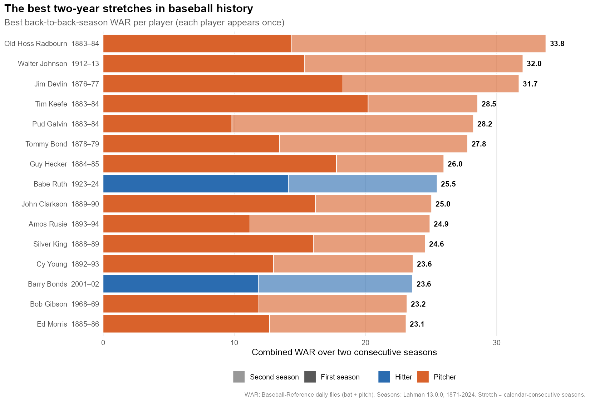
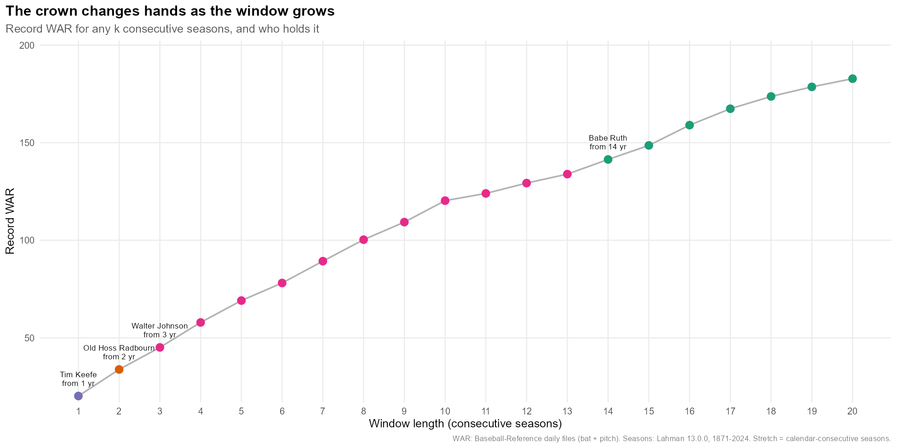

# mlb-war-streaks

**Which MLB player has had the highest WAR in consecutive seasons?** Short answer: it depends on how you read the question and which era you allow. Walter Johnson is the answer to most versions of it, and Babe Ruth is the best hitter. A handful of 1880s pitchers beat everyone on a two-year basis. The details are below.

Data: Lahman 13.0.0 (seasons 1871-2024, via the R `Lahman` package) joined by `playerID` to Baseball-Reference WAR (daily files, downloaded 2026-10-03).

**[View the full report](https://vjrupp49.github.io/mlb-war-streaks/)**: the answers, all 11 charts, the key tables and the interactive Streak Explorer on one page. The numbers behind it are in `output/WAR_streaks_tables.xlsx` (47 sheets).





## Run it

```         
Rscript R/run_all.R          # from this folder; or run the numbered scripts one at a time
```

| Script | What it does |
|------------------------------------|------------------------------------|
| `R/00_config.R` | Paths, era cutoffs, thresholds, shared helpers |
| `R/01_load_data.R` | Downloads the B-Ref WAR files (cached in `data/raw/`), merges stints, joins to Lahman, builds `data/processed/player_seasons.csv/.rds` |
| `R/02_analysis.R` | All four interpretations x every split. Writes `output/parts/tables/*.csv` |
| `R/03_sanity_checks.R` | 22 automated checks plus edge-case demos. Writes `output/parts/sanity_checks_report.txt` |
| `R/04_charts.R` | 11 PNG charts in `output/parts/charts/` |
| `R/05_streak_explorer.R` | The bonus feature: `output/parts/streak_explorer.html` |
| `R/06_bundle_outputs.py` | Bundles everything into one HTML report (published here as `docs/index.html`) and one Excel workbook, `output/WAR_streaks_tables.xlsx` (Python 3 + `openpyxl`) |

Needs R packages `tidyverse` (dplyr, tidyr, readr, stringr, purrr, ggplot2, scales), `slider`, `Lahman`, `ggrepel`, `patchwork`, `jsonlite`. All were already installed on this machine. A full run took roughly 20 minutes on a heavily loaded laptop, and about 8 of those are `02_analysis.R`.

## Where the WAR comes from (and the caveats)

Lahman has no WAR, so I used **Baseball-Reference WAR ("bWAR")** from their public daily files:

-   `https://www.baseball-reference.com/data/war_daily_bat.txt` (position players, plus pitchers' hitting)
-   `https://www.baseball-reference.com/data/war_daily_pitch.txt` (pitching)

The download worked, so nothing was substituted. The scripts download the files into `data/raw/` on the first run (git-ignored, not redistributed here) and reuse them afterwards, so re-runs don't change unless you delete them.

-   **Total WAR = bat file WAR + pitch file WAR**, summed per player-season. This is how B-Ref totals a player. It matters for two-way players: Ruth comes to 182.6 WAR (162.3 as a hitter plus 20.4 as a pitcher). The often-quoted 162.1 is his position-player total only.
-   **Joined on `People$bbrefID` = B-Ref `player_ID`.** Only 4 B-Ref MLB players lacked a Lahman match (0.7 WAR in total), listed in `output/parts/tables/diag_unmatched_war_players.csv`.
-   **Version drift:** B-Ref does not publish WAR version numbers and revises the methodology now and then. These results are a snapshot of the files as served on 2026-10-03. I compared 16 icons' career totals with the B-Ref figures I know. 15 matched within 3 WAR. Ruth was 20 off, which is the hitting-only versus total difference above. See `sanity_career_totals.csv`. Treat those reference numbers as approximate.
-   **Range:** the files also contain 2025-26. I stopped at **2024** because Lahman 13.0.0 does. Ohtani's and Judge's 2025 seasons, for example, are not counted. Change `MAX_YEAR` in `00_config.R` once Lahman catches up.
-   **What counts as MLB:** NL, AL, AA, UA, PL and FL. I excluded the 1871-75 National Association (so the data starts in 1876) and the **Negro Leagues**. The WAR files include the Negro Leagues, but Lahman does not, and their shortened schedules make season-to-season streaks hard to compare.
-   **1880s pitching WAR is huge** (Radbourn threw 678 IP in 1884). Those seasons are legitimate under B-Ref's method, but they dominate every all-time ranking, which is why the era splits matter so much.

## Definitions

-   **Consecutive** means calendar-consecutive seasons with an MLB player-season in the data. A missed year breaks the streak. Traded players' stints are summed into one season.
-   **Window of k seasons** is any k back-to-back seasons. "Best" is the highest total WAR, and each player appears once, at their best window. Tables are `a1_*` (k=2) and `a2_*` (k=3, 5, plus bonus lengths 7 and 10).
-   **Threshold streak** is a maximal run of consecutive seasons at or above a WAR threshold (tables `a3_*`, thresholds 4, 5, 6, 7, 8, 10).
-   **Both-elite pair** (`a4_*`) uses six definitions:
    -   both seasons at or above 6, 8 or 10 WAR;
    -   both seasons top-5 in MLB, or both #1 in MLB;
    -   the highest "floor" (the weaker of the two seasons).
-   **Hitter / Pitcher / Two-way.** Each season is **Two-way** if the player threw 50+ IP and played 30+ games at non-pitcher positions (DH included) that year. It is **Pitcher** if they threw 50+ IP otherwise, and **Hitter** otherwise. A streak is labelled "Hitter" or "Pitcher" only if every season in it is. Anything else, including mixed streaks like Ruth's 1919-21, is **"Two-way / mixed"**. Total WAR always counts both halves, so nobody loses credit. Ruth's best hitters-only stretches are in the "Hitter" rows.
-   **Eras.** A streak belongs to an era only if all of its seasons lie on one side of the cutoff. Streaks that straddle it are left out of the pre/post comparison. Results are shown for four cutoffs, **1901, 1920, 1947, 1969**, in every `*_splits.csv` and in `era_cutoff_sensitivity.csv`.
    -   **Primary cutoff: 1947.** Integration is when MLB first drew on its full talent pool, and it also sits after the dead-ball era and the 1893 pitching-distance change.
    -   1901 is the AL's start and the 20th century. 1920 is the live-ball era. 1969 is the mound-lowering and expansion.
-   **Edge cases:**
    -   **Shortened seasons** (1918, 1919, 1981, 1994, 1995, 2020) are flagged. The main tables use raw WAR. A pace-adjusted sensitivity scales those seasons to full length (2020 x2.7).
    -   **Military service:** a curated list of 13 documented cases (`data/reference/military_service_gaps.csv`) lets a "service-adjusted" mode bridge those exact gap years. Partial seasons (Williams 1952-53, Mays 1952) are in the data as small seasons, so they count as played years. Every other gap breaks the streak.
    -   **Gaps:** `sanity_best_gap_pairs_not_counted.csv` shows the best elite pairs that were *not* counted because a year is missing.

## Headline answers

**1. Best two-year stretch**

-   Overall, **Old Hoss Radbourn 1883-84, 33.8 WAR** (14.3 + 19.4). Walter Johnson 1912-13 is next with 32.0 and Jim Devlin 1876-77 with 31.7. Eleven of the top 15 are 1876-1899 pitchers.
-   **Best since 1900:** Walter Johnson 1912-13 (32.0).
-   **Best hitter:** Babe Ruth 1923-24 (25.5), then Barry Bonds 2001-02 (23.6) and Carl Yastrzemski 1967-68 (22.9).
-   **Best since 1947:** Bonds 2001-02 (23.6), barely ahead of Bob Gibson 1968-69 (23.2).

**2. Best 3- and 5-year stretches**

-   **Best 3-year:** Walter Johnson 1912-14 (45.1), then Radbourn 1883-85 (42.3). Ruth's 1919-21 (34.4) is #7. The best since 1947 is Gibson 1968-70 (33.2), then Mays 1963-65 (32.9) and Bonds 2001-03 (32.8).
-   **Best 5-year:** **Walter Johnson 1912-16, 69.1 WAR**, far ahead of Ruth 1920-24 (56.3), Clarkson 1885-89 (55.0), Radbourn (54.9) and Cy Young 1892-96 (54.3). **Mays 1962-66 (52.3)** and **Bonds 2000-04 (51.1)** follow. Since 1947 it runs Mays, Bonds, Joe Morgan 1972-76 (47.8), and Mike Trout 2012-16 (47.1) is #3 since 1969.
-   Johnson also holds the 7-year (89.4) and 10-year (120.3) records.

**3. Streaks above a threshold**

| Threshold | Longest streak | Next |
|------------------------|------------------------|------------------------|
| 5+ WAR | **Hank Aaron, 17 seasons (1955-71)** | Cy Young 15, Tris Speaker 15, Wagner 14, Schmidt 14 |
| 6+ WAR | **Cy Young 15 (1891-1905) and Aaron 15 (1955-69)** | Mays 13 (1954-66), Gehrig 12 |
| 8+ WAR | **Walter Johnson, 10 (1910-19)** | Ruth, Mays and Pujols 7 each |

Only one player in history has 10 straight 8+ seasons. Four have 7 or more.

**4. Both seasons elite**

-   With both seasons at 10+ WAR there are only **41 pairs by 24 players**. Radbourn 1883-84 (33.8) and Walter Johnson 1912-13 (32.0) lead. The best by a hitter is Ruth 1923-24 (25.5).
-   Ranked by the *weaker* season (the floor), **Walter Johnson 1912-13 is #1** (15.4 / 16.6). Next are Radbourn, Tommy Bond, Devlin, then **Ruth 1920-21 (11.8 / 12.6)** and **Bonds 2001-02 (11.9 / 11.7)**.
-   There are just **31 pairs (19 players) where the player was #1 in MLB both years**. They include Ruth 1926-27, Bonds 2001-02 and Gibson 1968-69.

## TL;DR for each split

-   **Hitters vs. pitchers:** Pitchers own the all-time lists. The best hitters are Ruth (2-year 25.5; 5-year 56.3), Mays 1962-66, Bonds 2000-04 and Yastrzemski 1967-68. Hitters hold the longest elite streaks, and Aaron's 17 is the longest. Of the two-way players, Ohtani 2020-24 has 37.2 WAR over five years and four straight 8+ seasons (2021-24). The 1880s pitcher-fielders Bob Caruthers and Jim Whitney post bigger numbers.
-   **Era:** The leader changes with the cutoff. For two-year stretches it goes Johnson (1901+), Ruth (1920+), Bonds (1947+) and Bonds (1969+). For five-year stretches it goes Johnson, Ruth, Mays, Bonds. **The all-eras ranking is a pre-1900 pitcher ranking**, and from 1920 on the answer is Ruth, Mays or Bonds depending on the length.
-   **Position (best 5-year):** C Gary Carter 1981-85 (33.9), 1B Lou Gehrig 1927-31 (47.1), 2B Rogers Hornsby 1921-25 (50.1), 3B Alex Rodriguez 2001-05 (42.5), SS Honus Wagner 1905-09 (49.2), OF Ruth (56.3), DH Frank Thomas 1991-95 (31.8), P Walter Johnson (69.1). Catchers and DHs are far behind. The positional adjustment and games played probably both play a part, but I haven't separated them.
-   **Decade:** The record-holder for each decade is in the splits tables. The best 3-year stretch is Johnson in the 1910s (45.1) and the 1880s pitchers. After 1920 it sits in a band of about 26-34: Ruth 1926-28 (34.1), Gibson 1968-70, Bonds 2001-03, Mantle 1955-57. Trout's 2014-16 stretch is 27.6 and Ohtani's 2022-24 is 28.6.
-   **Age at start:** The best streaks start at 24 (Johnson) or 27-28 (Devlin, Radbourn, Ruth 1923-27). Hitters can start later. Ruth's best five-year stretch beginning at 31 or older is 1926-30 (52.7).
-   **Franchise (one-team windows):** Washington/Minnesota (Johnson), NY Yankees (Ruth), Providence (Radbourn), Cleveland Spiders (Young), San Francisco (Mays), Pittsburgh (Wagner), St. Louis (Hornsby), Anaheim/LA Angels (Trout 47.1) and Cincinnati (Morgan) lead their franchises in the 5-year table.
-   **League:** AL's best is Johnson and NL's best is Clarkson (5-year) or Radbourn (2-year). "Other (AA/UA/PL/FL)" is the American Association and the other short-lived leagues, led by Keefe, Hecker and Caruthers.
-   **Peak vs. longevity** (`peak_vs_longevity.csv`, chart 08): Johnson is balanced (41% of career WAR in his best five years). **Ruth, Bonds, Mays and Aaron are longevity cases at about a third each.** **Sandy Koufax (80%), Hal Newhouser, Ron Santo, Jackie Robinson and Mookie Betts are peak-heavy.** Trout is at 55%.

## Anything surprising

1.  **Hank Aaron is nowhere near the top of the best-window lists (his best five years is 43.8) but wins the "most straight 5+ WAR seasons" list with 17.** He is the longevity champion with a modest peak.
2.  **Walter Johnson holds the record at every window length from 3 to 13 seasons.** His 10-year 8+ streak is a record by three seasons.
3.  **Seven 19th-century pitchers, plus Walter Johnson, outscore Ruth's best two years** (Ruth is #8), and 11 of the top 15 two-year stretches are from before 1900. The era cutoff is the single biggest decision in this project.
4.  **Service adjustment barely changes the top 10s.** It does lift Ted Williams' best five years from 41.3 (#48) to 49.2 (#14) once 1943-45 are bridged (1941-48), and Bob Feller's from 35.9 to 39.5. The pace adjustment for 1918/19/81/94/95/2020 doesn't change who is in any top-10 list (it only reorders a few places at the 3- and 10-year lengths).
5.  **Ohtani is the only modern two-way player on the elite lists**, and by total WAR he is still far behind Ruth's two-way production (Ruth's 1919-21 is 34.4).
6.  **Trout's 2012-16 (47.1) ranks #22 all-time for five years.**

## Sanity checks

`output/parts/sanity_checks_report.txt` lists all 22 checks, and all pass. They cover:

-   **Structure:** one row per player-season, WAR equals bat plus pitch everywhere, no missing WAR, leagues limited to MLB.
-   **Career totals** within 8 WAR of B-Ref for Ruth, Bonds, Mays, Mantle, Gibson, Clemens, Maddux, Trout, Williams, Cy Young, Walter Johnson, Aaron, Cobb, Musial, Wagner and Randy Johnson.
-   **Ranks:** Ruth is the #1 hitter for 2 years and #2 overall for 5 years. Bonds is a top-3 post-1946 3-year stretch and #10 overall for 5 years.
-   **Edge cases:** trades and stints, two-way labels (Ruth 1918-19, Ohtani 2021-23), shortened-season flags, the Williams and Mays service gaps, and the exclusion of gapped pairs.

Three of my first-draft checks failed and I changed them. I had expected Ruth to be a top-3 two-year player overall and Bonds a top-10 three-year player overall, which ignored the 1880s pitchers. I also had Ruth's career total at 162.1 when that is his hitting-only figure. I rewrote those checks to what the data should show, and explained that in the script comments.

## The unexpected extra: WAR Streak Explorer

It is embedded in the report and also saved as its own offline file, `output/parts/streak_explorer.html` (about 260 KB, no server or internet needed). It holds all 864 players with 30+ career WAR.

-   Pick a player and drag a slider for window length (1-20 seasons).
-   It highlights their best run of consecutive seasons on a season-by-season "barcode", with missing years marked.
-   It shows their all-time rank and what percentage of the record they hit.
-   It finds their **streak twins**: the three players whose best window had the closest year-by-year WAR shape. You can overlay a twin's line on theirs.
-   There is a toggle to stop military service from breaking a streak.
-   A "crown" strip shows who holds the record at each of the 20 lengths. The record passes from Tim Keefe (1 season) to Radbourn (2) to Walter Johnson (3-13) to Ruth (14-20).

**Why I picked it:** a ranking table answers one question, and the real issue here is that the answer changes with the window length. Making k a slider turns that into something you can feel. The streak twins also add "who did this look like?", which a leaderboard can't. I checked it against the R results: Johnson's five-year record is 69.1, Ruth's is 56.3, and Williams is 49.2 versus 41.3 when service is bridged.

## Outputs

**The two deliverables:**

-   `docs/index.html` (published as the link at the top): one page with the answers, all 11 charts, the key tables and the interactive Streak Explorer embedded. Everything is inside the file, so it also works offline.
-   `output/WAR_streaks_tables.xlsx`: every results table (47 sheets, including all the split breakdowns) with a clickable "Contents" tab.

`output/parts/` holds the individual pieces the report and workbook are built from: about 45 CSVs in `tables/`, the 11 PNGs in `charts/`, the stand-alone explorer and the sanity-check report.

-   `a1_*`, `a2_*`: best windows, with `_top30`, `_top40_all_overlapping_windows`, `_splits` and `_sensitivity_modes` files.
-   `a3_*`: threshold streaks, with top 25 lists, splits, counts and a service-adjusted view.
-   `a4_*`: both-elite pairs.
-   Also `era_cutoff_sensitivity`, `peak_vs_longevity`, `crown_best_window_by_length`, and the `sanity_*` and `diag_*` tables.
-   `data/processed/player_seasons.csv` (generated by `01_load_data.R`, git-ignored) is the cleaned player-season table behind everything.

## How it was built

Developed with AI coding assistance (Claude Code). The research question and the list of interpretations and splits to test were specified by me; the implementation was done with Claude Code, with 22 automated sanity checks to catch the kind of mistakes an assistant (or a person) could make.

## Credits and data

Lahman Baseball Database (Sean Lahman) and Baseball-Reference WAR. Neither raw dataset is redistributed in this repo. Built by Vincent Rupp. Released under the MIT License (code only; third-party data keeps its own terms); see `LICENSE`.
